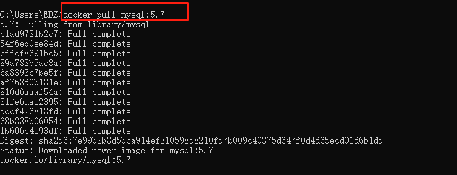
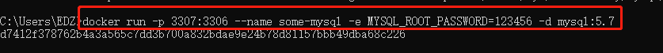
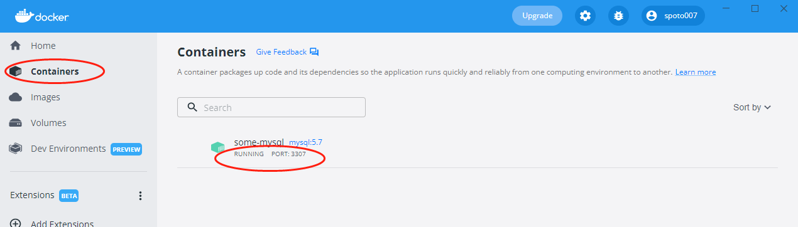
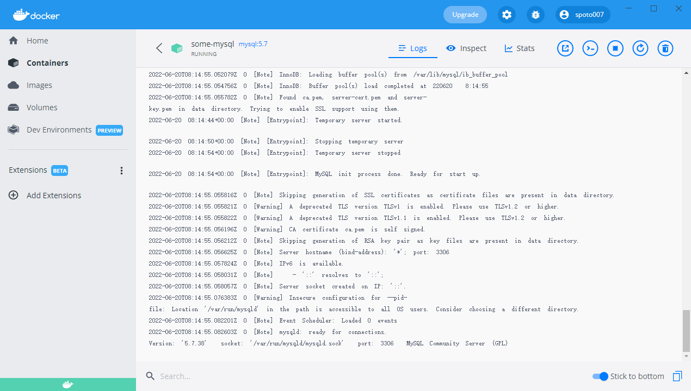
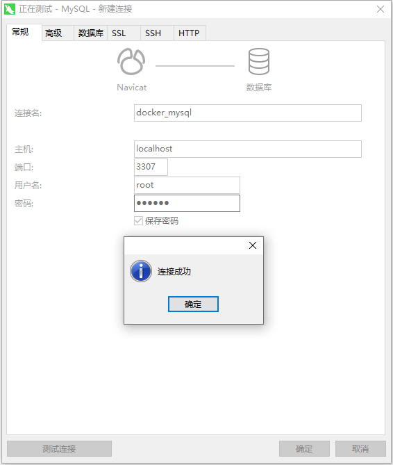

## 本地docker环境运行mysql

### 1.下载并安装docker desktop
* 安装参考：https://www.runoob.com/docker/windows-docker-install.html
* 下载链接：https://docs.docker.com/desktop/windows/install/

### 2.拉取镜像
* 参考链接：https://hub.docker.com/_/mysql
```
   docker pull mysql:5.7
```


### 3.指定映射端口，并运行mysql容器
```
   docker run -p 3307:3306 --name some-mysql -e MYSQL_ROOT_PASSWORD=123456 -d mysql:5.7
```

* 参考链接：https://www.cnblogs.com/hellowhy/p/14590163.html

### 5.查看容器运行状态


### 4.客户端连接测试(端口3307，密码123456)
    

**- End -**
