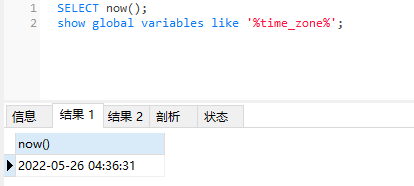
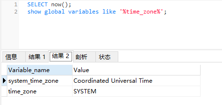
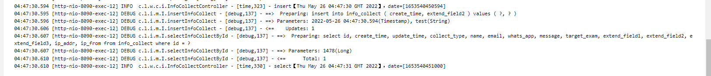
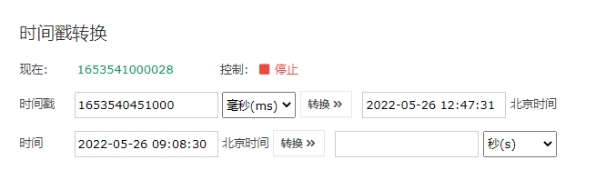
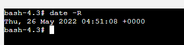
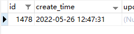
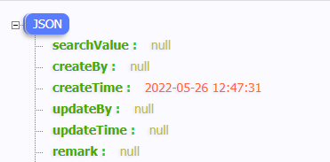

## 时区问题整理

参考链接
* MySQL查看和修改时区time_zone：[https://devnote.pro/posts/10000004161181](https://devnote.pro/posts/10000004161181)
* datetime与timestamp区别及使用选择：[https://devnote.pro/posts/10000004151181](https://devnote.pro/posts/10000004151181)

#### 时间格式
****  
**GMT**（Greenwich Mean Time）：格林威治标准时间  
**UTC**（Coordinated Universal Time）协调世界时    
**CST**（China Standard Time）：中国标准时间

GMT + 8 = UTC + 8 = CST

#### 海外服务器环境验证
**** 
1. 通过mysql协议，在连接数据库时，指定所在的时区：**GMT+8** 
```
    jdbc:mysql://localhost:3306/db?useUnicode=true&characterEncoding=utf8&serverTimezone=GMT%2B8
```
2. 通过Navicat，观察mysql当前时间，和使用时区
```
    SELECT now()
    -- 此时，实际本地北京时间：2022-05-26 12:36:31
    -- 服务器时间：2022-05-26 04:36:31
```

```
    show global variables like '%time_zone%'
    -- 观察服务器所使用的时区为：UTC0
```


3. java代码调试
```
    @ResponseBody
    @GetMapping("/time")
    public InfoCollect time() {
        Date date = new Date();
        logger.info("insert【{}】，date=[{}]", date, date.getTime());
        InfoCollect create = new InfoCollect();
        create.setCreateTime(date);
        create.setExtendField2("test");
        infoCollectService.insertInfoCollect(create);

        InfoCollect infoCollect = infoCollectService.selectInfoCollectById(create.getId());
        logger.info("select【{}】，date=[{}]", infoCollect.getCreateTime(), infoCollect.getCreateTime().getTime());
        return infoCollect;
    }
```
5. 结果观察

日志内容


   
```
    04:47:30.594 [http-nio-8090-exec-12] INFO  c.l.w.c.i.InfoCollectController - [time,323] - insert【Thu May 26 04:47:30 GMT 2022】，date=[1653540450594]
    04:47:30.595 [http-nio-8090-exec-12] DEBUG c.l.i.m.I.insertInfoCollect - [debug,137] - ==>  Preparing: insert into info_collect ( create_time, extend_field2 ) values ( ?, ? )
    04:47:30.596 [http-nio-8090-exec-12] DEBUG c.l.i.m.I.insertInfoCollect - [debug,137] - ==> Parameters: 2022-05-26 04:47:30.594(Timestamp), test(String)
    04:47:30.606 [http-nio-8090-exec-12] DEBUG c.l.i.m.I.insertInfoCollect - [debug,137] - <==    Updates: 1
    04:47:30.607 [http-nio-8090-exec-12] DEBUG c.l.i.m.I.selectInfoCollectById - [debug,137] - ==>  Preparing: select id, create_time, update_time, collect_type, name, email, whats_app, message, target_exam, extend_field1, extend_field2, extend_field3, ip_addr, ip_from from info_collect where id = ?
    04:47:30.607 [http-nio-8090-exec-12] DEBUG c.l.i.m.I.selectInfoCollectById - [debug,137] - ==> Parameters: 1478(Long)
    04:47:30.610 [http-nio-8090-exec-12] DEBUG c.l.i.m.I.selectInfoCollectById - [debug,137] - <==      Total: 1
    04:47:30.610 [http-nio-8090-exec-12] INFO  c.l.w.c.i.InfoCollectController - [time,330] - select【Thu May 26 04:47:31 GMT 2022】，date=[1653540451000]
```
时间戳转北京时间：


服务器时间：



mysql存储



浏览器展示



6. 总结
* 同一时刻x，全球各地的时间戳值相同
  
  UTC+5的中午12点是2022-05-26 12:00:00，此时，UTC+8的时间是2022-05-26 15:00:00


* insert操作
  
  java new Date()，拿到的是【Thu May 26 04:47:30 GMT 2022】，date=[1653540450594]
  
  保存到数据库是数据库连接指定时区后，存的时间戳1653540450594


* select操作
  
  取出来是时间戳，根据服务器本地，解析成带时区的日期【Thu May 26 04:47:31 GMT 2022】，date=[1653540451000]

  时间戳尾数000，因为数据库存到秒，把毫秒截断了，所以取出来+1秒了，
  
  存进去的是04:47:30秒，取出来04:47:31秒，如果是存23:59:59，+1秒会跳到第二天


* 时间戳，指定时区转回Date


#### 时间转换问题
****
* 基于jackson注释@JsonFormat 格式化时间少8小时：[https://www.cnblogs.com/programmer1/p/8267877.html](https://www.cnblogs.com/programmer1/p/8267877.html)
#### 名词解释
****
**格林尼治标准时间**

格林尼治标准时间（英语：Greenwich Mean Time，GMT）又称格林尼治平均时间，是指位于英国伦敦郊区的皇家格林尼治天文台当地的平太阳时，因为本初子午线被定义为通过那里的经线。

自1924年2月5日开始，格林尼治天文台负责每隔一小时向全世界发放调时信息。

格林尼治标准时间的正午是指当平太阳横穿格林尼治子午线时（也就是在格林尼治上空最高点时）的时间。由于地球每天的自转是有些不规则的，而且正在缓慢减速，因此格林尼治平时基于天文观测本身的缺陷，目前已经被原子钟报时的协调世界时（UTC）所取代。

**平太阳**

平太阳或假太阳是一个假想的天体，它每年和真太阳同时从春分点出发，在天赤道上从西向东匀速运行，这个速度相当于真太阳在黄道上运行的平均速度，最后和真太阳同时回到春分点。

人们最初确定时间的方式是直接观测太阳在当地天空中的位置，例如使用日晷，这样测量出来的时间被称为地方真太阳时（local apparent solar time / local apparent time）。后来，人们为了解决“地球公转轨道不是正圆”和“黄道与赤道之间存在夹角”而造成的测出的时间的流逝不均匀的问题，以假想天体“平太阳”（mean Sun）为基准测量时间，而不再以真太阳为基准，这样测量出来的时间被称为地方平太阳时（local mean solar time / local mean time）。地方真太阳时和地方平太阳时的差异被称为均时差（equation of time）。

**本初子午线**

本初子午线（英语：Prime meridian），即0度经线，亦称格林尼治子午线或本初经线，是经过英国格林尼治天文台的一条经线（亦称子午线）。本初子午线的东西两边分别定为东经和西经，于180度相遇。

除了定义经度，格林尼治子午线亦曾作为世界时间标准使用。理论上来说，格林尼治标准时间的正午是指当太阳横穿格林尼治子午线时的时间。然而因为地球自转速度并不规则，现在的世界标准时间基准已由协调世界时取代。

**国际换日线**

原理是从零度经线所在时区向东每跨1个区间时钟就拨快1小时，而向西每跨1个区间时钟就拨慢1小时，如此一来，到了另一端经线180度附近，就会有24小时的落差。为解决日期紊乱问题，大致上以180度经线作为日界线；

由于照顾行政区域的统一，因此日界线并不完全沿180°的子午线划分，而是绕过一些岛屿和海峡：由北往南通过白令海峡和阿留申群岛、萨摩亚、斐济、汤加等岛屿到达新西兰的东边。

**协调世界时**

协调世界时是世界上调节时钟和时间的主要时间标准，它与0度经线的平太阳时相差不超过1秒[5]，并不遵守夏令时。协调世界时是最接近格林威治标准时间（GMT）的几个替代时间系统之一。对于大多数用途来说，UTC时间被认为能与GMT时间互换，但GMT时间已不再被科学界所确定。

在军事中，协调世界时区会使用“Z”来表示。而在航空上，所有使用的时间划一规定是协调世界时。而且Z在无线电中应以北约音标字母读作“Zulu”，协调世界时也会被称为“Zulu time”。比如说飞机在香港时间（UTC+8）18:00整起飞，就会写成1000z，又或者读作“1000Zulu”。

如果本地时间比UTC时间快，例如中国大陆[注 1]、香港、澳门、台湾、蒙古国、菲律宾、新加坡、马来西亚、澳大利亚西部的时间比UTC快8小时，就会写作UTC+8，俗称东八区。相反，如果本地时间比UTC时间慢，例如夏威夷的时间比UTC时间慢10小时，就会写作UTC-10，俗称西十区。

#### 时区和区时
****  
* 时区列表：[https://zh.wikipedia.org/wiki/时区列表](https://zh.wikipedia.org/wiki/时区列表)
* 时区：全球划分为24个时区，每个时区占经度15°
* 区时：各个时区都以该时区**中央经线**的地方时 为 整个时区的同一时间，叫区时，又叫**标准时**

[comment]: <> (![RUNOOB 图标]&#40;https://p1-jj.byteimg.com/tos-cn-i-t2oaga2asx/gold-user-assets/2020/4/17/1718646fbdf72026~tplv-t2oaga2asx-zoom-in-crop-mark:1304:0:0:0.awebp "RUNOOB"&#41;)
参考链接：[https://juejin.cn/post/6844904129962180616](https://juejin.cn/post/6844904129962180616)

**- End -**
**** 
